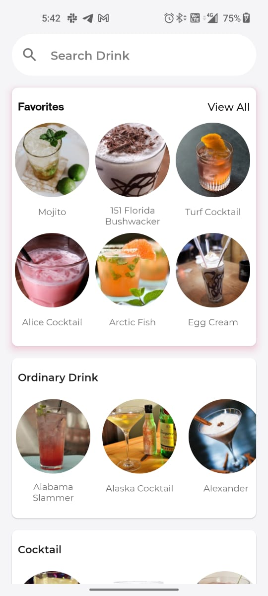
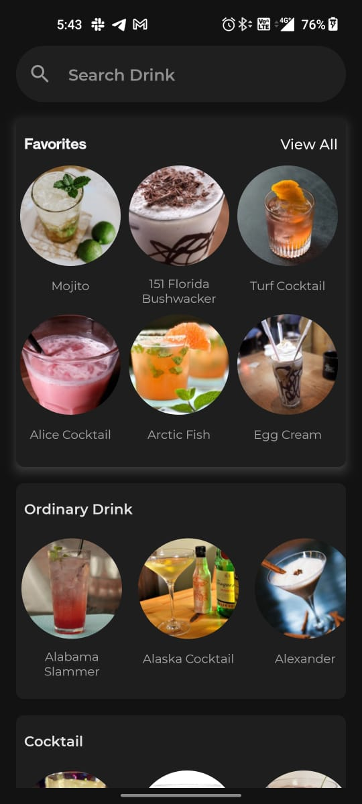
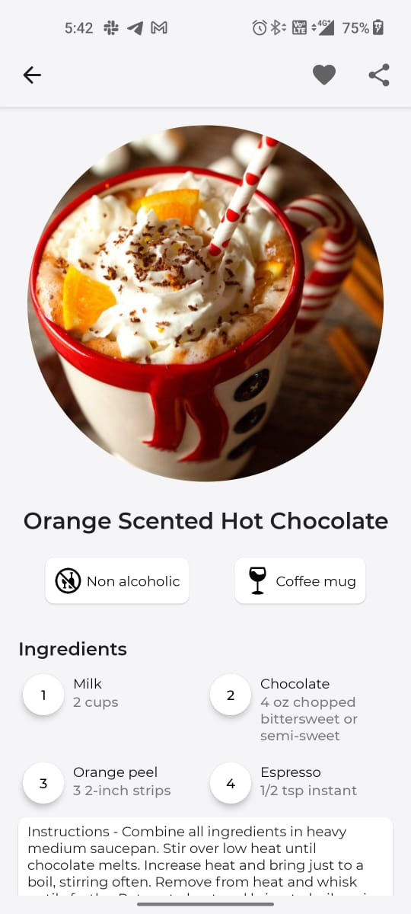
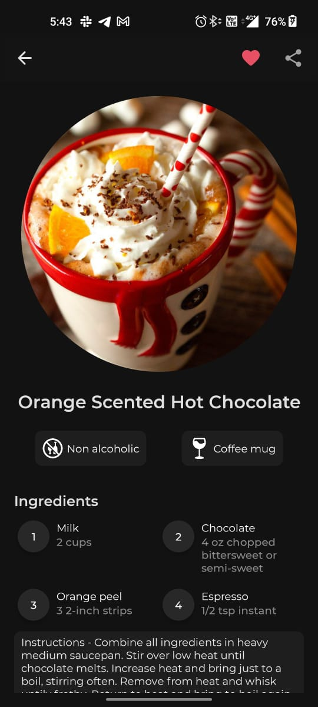
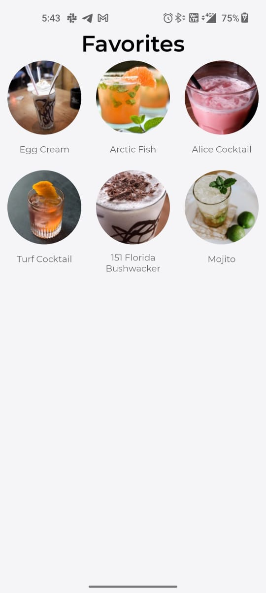
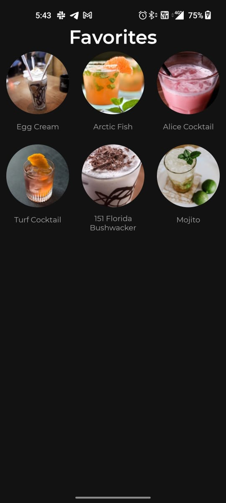

# 🍹 Drunkyard  

> Drunkyard is a receipe app which provides receipes to create the best cocktails. It contains carefully chosen and verified cocktail recipes with step by step guides. 
Have any drink in mind? Just search and get drinks and cocktails from an open, crowd-sourced database from around the world powered by the `Thecocktaildb's API`

## Preview

&nbsp;&nbsp;&nbsp;&nbsp;

&nbsp;&nbsp;&nbsp;&nbsp;

&nbsp;&nbsp;&nbsp;&nbsp;

## Featured in
- [Android Authority](https://www.androidauthority.com/new-android-apps-658839/) - Best Android Apps of January 2023 🏆 

## 🛠 Built With 
- [Kotlin](https://kotlinlang.org/) - First class and official programming language for Android development.
- [Jetpack Compose](https://developer.android.com/jetpack/compose) - Android’s recommended modern toolkit for building native UI.
- [MVVM Architecture](https://developer.android.com/topic/architecture?gclid=CjwKCAiA7vWcBhBUEiwAXieIti2J467093HtRTEp-H4LJKu2NlwV5sQtEftMVE03549xPm3bTlf03BoCVKsQAvD_BwE&gclsrc=aw.ds#recommended-app-arch) - Follows Model View ViewModel architecture
- [Flow](https://developer.android.com/kotlin/flow) -  A flow is a type that can emit multiple values sequentially, as opposed to suspend functions that return only a single value.
- [ViewModel](https://developer.android.com/topic/libraries/architecture/viewmodel) - Stores UI-related data and capture UI changes. 
- [Room](https://developer.android.com/topic/libraries/architecture/room) - SQLite object mapping library.
- [TheCocktailDB](https://www.thecocktaildb.com/api.php) - API for fetching Drinks/Cocktails

## ✍️ Author

👤 **abhinav12k**

- Website: <a href="https://abhinav12k.github.io/" target="_blank">abhinav12k</a>
- LinkedIn: <a href="https://www.linkedin.com/in/abhinav12k/">abhinav12k</a>
- Email: abhi2000.rtk@gmail.com

Feel free to ping me 😉

## 🤝 Contributing

Contributions are what make the open source community such an amazing place to be learn, inspire, and create. Any contributions you make are **greatly appreciated**.

1. Open an issue first to discuss what you would like to change.
2. Fork the Project
3. Create your feature branch (`git checkout -b feature/amazing-feature`)
4. Commit your changes (`git commit -m 'Add some amazing feature'`)
5. Push to the branch (`git push origin feature/amazing-feature`)
6. Open a pull request

## ❤ Show your support

Give a ⭐️ if this project helped you!

## © 2022 Abhinav. All rights reserved.
